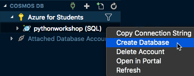
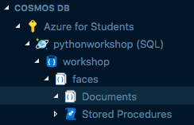

# Save the face details to a database

In the [previous step](./AnalyseThePhotoUsingAI.md) you analyzed the image for faces using AI, checking each face for emotion. In this step you will save the results of the analysis into a database.

## Create a database

Once faces have been analyzed, the data needs to be stored somewhere so that it can be shown on a web page later. The database that this workshop will use is called [Cosmos DB](https://azure.microsoft.com/services/cosmos-db/?WT.mc_id=pythonworkshop-github-jabenn). Cosmos DB is a document database - instead of storing data in columns, rows and tables, Cosmos DB allows you to store, retrieve and search for JSON documents from inside named collections.

To create a Cosmos DB database, you first create an account. Inside the account you can create databases, and these databases can each contain one or more collections. Documents are stored in collections.

### Create a Cosmos DB account

* Open the command palette:
  * On Windows, press Ctrl+Shift+P
  * On MacOS, press Cmd+Shift+P

* From the Visual Studio Code command palette, select *Cosmos DB: Create Account*

  

* Select the Azure subscription you want to use.
  
  

* Give your account a name. This only needs to be unique to you, and needs to be between 3 and 31 characters and only contain letters, numbers or '-'.
  
  

* Select an API for the Cosmos DB account. Cosmos DB has a number of ways you can access the data, some mimicking other databases. For this workshop, select *SQL (Document DB)*.
  
  

* Select the resource group you want to run the code in. One would have been created for you when you deployed the web app in an earlier step called something like `appsvc_rg_linux_centralus`, so select this one.
  
  

* Select a location for the Cosmos DB resource. Choose a location closest to you.
  
  

* The Cosmos DB resource will be created, and a dialog will appear showing the progress. This will take a few minutes.
  
  

### Create a database and collection

* From Visual Studio Code, select the *Azure* tab.

* Expand the *COSMOS DB* section.

* Expand your subscription.

* Right-click on the account you just created and select *Create Database*.

  

* Name the database `workshop`.
  
  

* Name the collection `faces`.
  
  

* Leave the partition key blank.
  
  

* Leave the initial throughput as 400.
  
  

Once created, you will be able to see the new collection in the *COSMOS DB* panel in the *Azure* tab.



## Install the Cosmos DB package

There is a Cosmos DB client available as a Python package.

* Open the `requirements.txt` file in Visual Studio Code.

* Add the following to the bottom of the file:

  ```python
  azure.cosmos
  ```

* Save the file

* Install the new package from the terminal using the following command:
  
  ```sh
  pip install -r requirements.txt
  ```

## Write the code

* Open the `app.py` file in Visual Studio Code.

* Add an import for the Cosmos DB client below the other imports.
  
  ```python
  import azure.cosmos.cosmos_client as cosmos_client
  ```

* Add the following code just above the `home` function, above the route declaration:
  
  ```python
  cosmos_url = ''
  cosmos_primary_key = ''
  cosmos_collection_link = 'dbs/workshop/colls/faces'
  client = cosmos_client.CosmosClient(url_connection=cosmos_url,
                                      auth = {'masterKey': cosmos_primary_key})
  ```

* Find the new collection in the *COSMOS DB* panel in the *Azure* tab.

* Right-click on the collection and select *Copy connection string*.
  
  

* Paste this connection string into a text editor - for example as a comment inside the `app.py` file, or into a new file. It needs to be split into parts before it can be used.

  * The connection string is in the format:
  
    ```sh
    AccountEndpoint=https://<Cosmos DB Account Name>.documents.azure.com:443/;AccountKey=<Your key>
    ```
  
  * Extract the `AccountEndpoint` value. This is from **After** `AccountEndpoint=` up to **but not including** the semi-colon. It will be in the format `https://<Cosmos DB Account Name>.documents.azure.com:443/` where `<Cosmos DB Account Name>` is the name you used for your Cosmos DB account.
  
  * Use this value as the value for the `cosmos_url` variable.

  * Extract the `AccountKey` value. This is from **After** `AccountKey=` up to the end of the connection string and will end in a double equals - `==`.

  * Use this value for the `cosmos_primary_key` variable.
  
  > This key is being added to code simply for convenience when building your first app. In a real-world app, you would define keys like this in application settings and extract them using environment variables. You can read more on this in the [App Service documentation](https://docs.microsoft.com/azure/app-service/containers/how-to-configure-python#access-environment-variables?WT.mc_id=pythonworkshop-github-jabenn).

* Add the following line to the `upload_image` function inside the loop and after the `doc` is created:
  
  ```python
  ...
  for face in faces:
    ...
    client.CreateItem(cosmos_collection_link, doc)
  ...
  ```

* Save the file

## Deploy the code

* Open the command palette:
  * On Windows, press Ctrl+Shift+P
  * On MacOS, press Cmd+Shift+P

* Select *Azure App Service: Deploy to Web App...*
  
  

* A dialog will pop up asking if you want to overwrite the existing deployment. Select the **Deploy** button.
  
  

* A popup will appear showing the deployment progress. You can monitor the progress from the *Output* window by selecting *View -> Output* and selecting *Azure App Service* from the window selector.
  
  

* Open the web site in your browser to verify that everything is working correctly.

## What does this code do

The overall flow of this code is:

1. Create a Cosmos DB client, connecting to the newly created account
2. Insert the document with the face details into the newly created collection

Lets look in more detail at the actual code.

```python
import azure.cosmos.cosmos_client as cosmos_client
```

This tells the Python compiler that we want to use the `azure.cosmos.cosmos_client` package.

```python
cosmos_url = '<AccountEndpoint from connection string>'
cosmos_primary_key = '<AccountKey from connection string>'
```

These two variables store the connection information for the Cosmos DB account - the URL where it is running from, and a secret key to give you access.

```python
cosmos_collection_link = 'dbs/workshop/colls/faces'
```

Each database and collection in Cosmos DB has a name. You can access database and collections using a link - this is a string that defines the database and collection name and is in the format `dbs/<Database name>/colls/<Collection name>`. This link can be used to identify the collection that we want to insert the face information into. If you used a different name for the database or collection, you will need to update this.

```python
client = cosmos_client.CosmosClient(url_connection=cosmos_url,
                                    auth = {'masterKey': cosmos_primary_key})
```

This code creates a client connection to Cosmos DB using the URL and primary key. This client can be used to insert new or retrieve existing documents.

```python
client.CreateItem(cosmos_collection_link, doc)
```

The `doc` object contains the face information, and it is inserted into the collection using the collection link to indicate which collection it should be inserted into.

## Next steps

In this step you created a Cosmos DB collection, and saved the results of the analysis into a database. In the [next step](./ReturnTheEmotionCount.md) you will return the count of each emotion from this Web Api.
