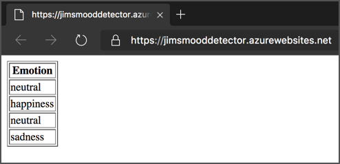

# Create a web page to view the results

In the [previous step](./CallTheWebApiFromDesktop.md) you connected the photo taking app to the Web Api and tested it out, uploading a picture and seeing the results of the analysis in Cosmos DB. In this step you will create a web page to view the data from the database.

## Rendering HTML

There are two ways to return an HTML page from a Flask app. You can return text and have it wrapped into a simple HTML page, just like the existing `/` route, or you can use templates. Templates allow you to define some HTML that can show data in some way, and use that template with data to build an HTML page. For example if you wanted to show page with a list of names you could specify a template that iterated the list and returned list items, then use that template with some actual data to create the list in HTML.

Converting a template and data to HTML is called *Rendering*.

The data in the Cosmos DB collection can be converted to a table by rendering it using a template that defines the table with rows for each item in the database and a single columns the emotion.

## Create the template

Templates live in a folder called `templates`.

* Create a new folder in Visual Studio Code inside your app folder. To do this, select the *New folder* button from the *Explorer* tab.
  
  

* Name this folder `templates`.

* Create a new file in this folder called `home.html`

## Write the code

* Add the following code to the `home.html` template:

  ```html
  <!doctype html>
  <html>
    <body>
      <table border = 1>
        <tr>
          <td>Emotion</td>
        </tr>
        
          <tr>
            <td> {{ row.emotion }} </td>
          </tr>
        
      </table>
    </body>
  </html>
  ```

* Save the file

* Open `app.py`

* At the start of the file import the `render_template` member from the flask module by adding it to the existing import statement
  
  ```python
  from flask import Flask, request, render_template
  ```

* Replace the `home` function with the following code:
  
  ```python
  @app.route('/')
  def home():
    docs = list(client.ReadItems(cosmos_collection_link))
    return render_template('home.html', result = docs)
  ```

* Save the file

## Deploy the code

* Open the command palette:
  * On Windows, press Ctrl+Shift+P
  * On MacOS, press Cmd+Shift+P

* Select *Azure App Service: Deploy to Web App...*
  
  

* A dialog will pop up asking if you want to overwrite the existing deployment. Select the **Deploy** button.
  
  

* A popup will appear showing the deployment progress. You can monitor the progress from the *Output* window by selecting *View -> Output* and selecting *Azure App Service* from the window selector.
  
  

* Open the web site in your browser.

The home page will no longer show `'Hello World'`, instead it will show a table for all the faces that have been analyzed. Take some more pictures and refresh the page to see it update with new data.



## What does this code do

### The template file

```html
<!doctype html>
<html>
<body>
  ...
</body>
</html>
```

This is a standard HTML file with a body.

```html
<table border = 1>
  <tr>
    <th>Emotion</th>
  </tr>
  ...
</table>
```

This is a standard HTML table with a 1-pixel border, and a single header row with one column headers - Emotion.

```html

...

```

This code is part of the templating syntax. It tells the templating engine to look for some data passed in called `results`. It will loop through all the items in the `results` list and put each one into a variable called `row` that can be used in the code inside the loop. This is similar to a Python `for` loop.

```html
<tr>
  <td> {{ row.emotion }} </td>
</tr>
```

This is also template code. For each `row` in the `results`, this code outputs an HTML table row with three cells containing the values of the `emotion` property of the `row`.

### The `app.py` file

```python
docs = list(client.ReadItems(cosmos_collection_link))
```

This code uses the Cosmos DB client to read all the items from the `faces` collection into a `list`.

```python
return render_template('home.html', result = docs)
```

This code renders the `home.html` template using the `docs` variable, and returns this as HTML.

## Next step

In this step you created a web page to view the data from the database using an HTML template. In the [next step](./CleanUp.md) you will clean up your Azure resources.
